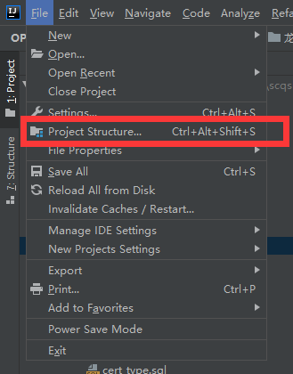
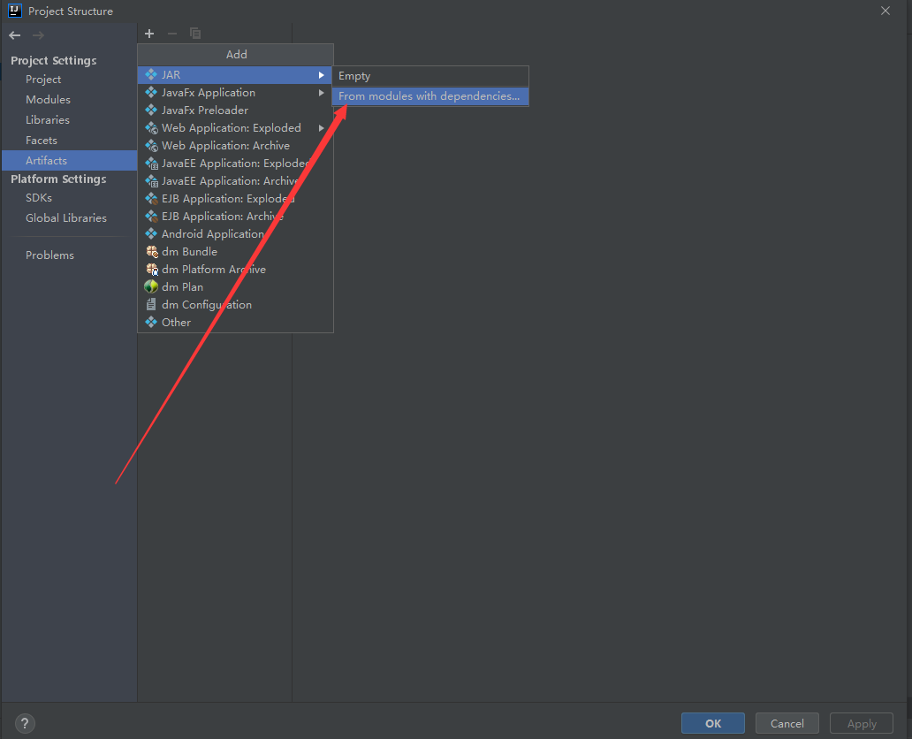
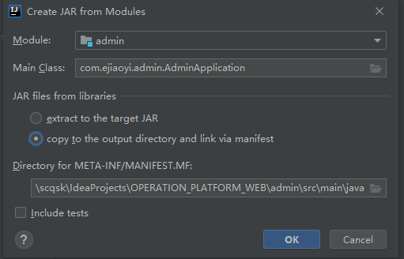
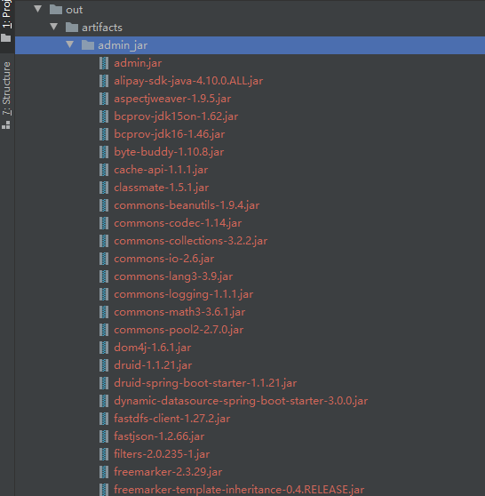
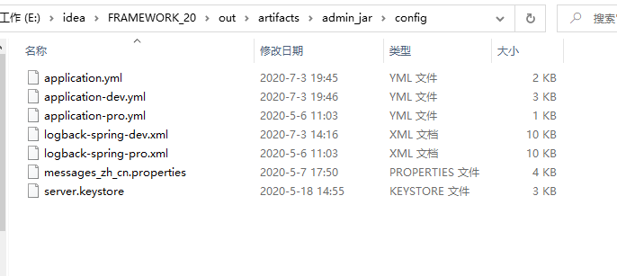
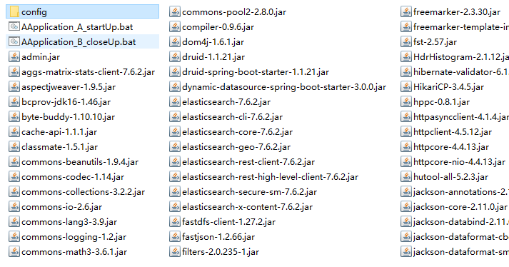
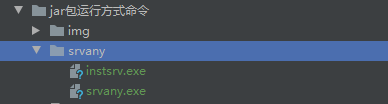
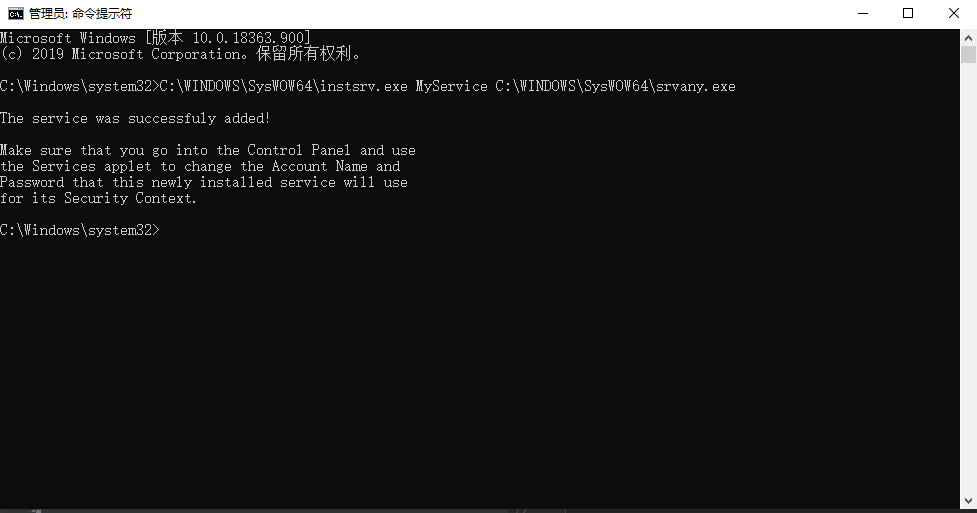
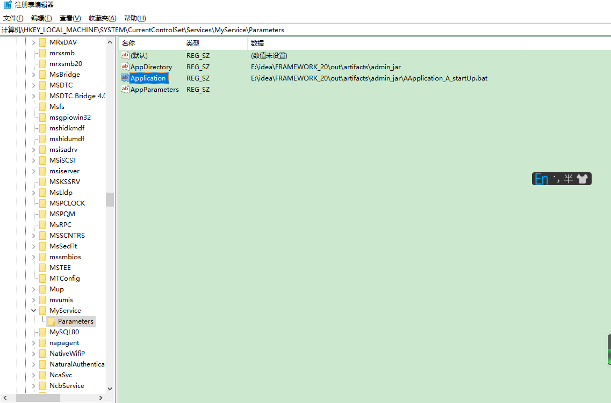
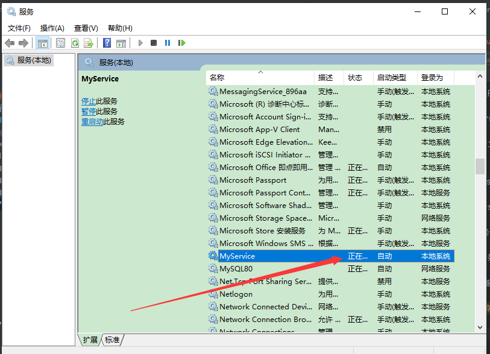

**<h1>项目部署流程</h1>
  
 
 <h3>大纲</h3>
 <ul>
  <li>1.程序打包</li>
  <li>2.程序安装，配置独立</li>
  <li>3.编写程序运行与关闭bat</li>
  <li>4.将bat注册为服务</li>
 </ul> 

 

 
 **<h2>一、项目打包</h2>*
<h3>1.选中项目结构设置</h3>
 

 
<h3>2.选中项目打包方式 jar</h3> 
 

 
<h3>3.选择需要打包的模块，选择主类；</h3>
 
同时选择lib，已jar包方式依赖；
 
选择打包信息的输出路径，注意路径需要选择为resources!
 
(`默认的地址有误`)
 
否者打包以后将会报无法加载主类的bug.
 

;

 
<h3>4.打包以后的编译出来的如图</h3>
 

;

 

**<h2>二、项目部署</h2>*  

 1.在服务器上选择一个路径，并将项目的所有的jar，拷贝在目标路径
  
 2.在目标文件夹中建立cofig文件夹，并将所有的配置文件放入进去

 
 3.在目标文件夹中建立 启动bat，与关闭bat.
 如图 AAXXXXX_startUp.bat 
 内部命令内容：
  
 /--------------------start--------------------/
  
 @echo off 
 :: 程序以javaw 方式运行，内部默认文件格式utf-8  服务器指定内存 开始启动 
 start javaw -Dfile.encoding=utf-8 -server -Xms1024m -Xmx4096m -XX:+UseG1GC -jar admin.jar 
 :: 程序运行完成 
 exit 
  
/--------------------end--------------------/
     
AAXXXXX_CloseUP.bat 
/--------------------start--------------------/
 
@echo off 
::寻找端口号为9002 的进程 
 
for /f "tokens=5" %%i in ('netstat -aon ^| findstr ":9002"') do ( 
set n=%%i 
) 
::杀死找出的进程 
if defined n (taskkill /f /pid %n%) 
 
/--------------------end--------------------/
 

 
部署完成 点击 start.bat 运行程序，点击close.bat 关闭程序

 

**<h2>三、将bat注册为服务开机启动</h2>*  
 
1.将instsrv.exe和srvany.exe拷贝到"C:\WINDOWS\system32"目录下（如果是64bit系统，则将其拷贝到C:\WINDOWS\SysWOW64），用instsrv.exe安装srvany.exe，进入dos界面：

2.打开cmd 以管理员权限运行： 
"C:\WINDOWS\SysWOW64\instsrv.exe MyService C:\WINDOWS\SysWOW64\srvany.exe"
 
注：Myservice是自定义的服务的名称，可以根据应用程序名称任意更改。

3. 点击"开始-运行-regedit"打开注册列表，定位到以下路径：
 
HKEY_LOCAL_MACHINE\SYSTEM\CurrentControlSet\Services\MyService
 
MyService是你安装srvany.exe时定义的名称。
 

一般情况下该服务名下没有Parameters项目，需要手动建立：对服务名称项目右击新建项，名称为
 
Parameters，然后定位到Parameters项，新建以下几个字符串值。
 
名称 Application 值为你要作为服务运行的程序地址。
 
名称 AppDirectory 值为你要作为服务运行的程序所在文件夹路径。
 
名称 AppParameters 值为你要作为服务运行的程序启动所需要的参数
 

 
4.打开服务开机启动
 

 
注：删除服务 命令”sc delete MyService“ MyService是你自定定义的应用名称
  